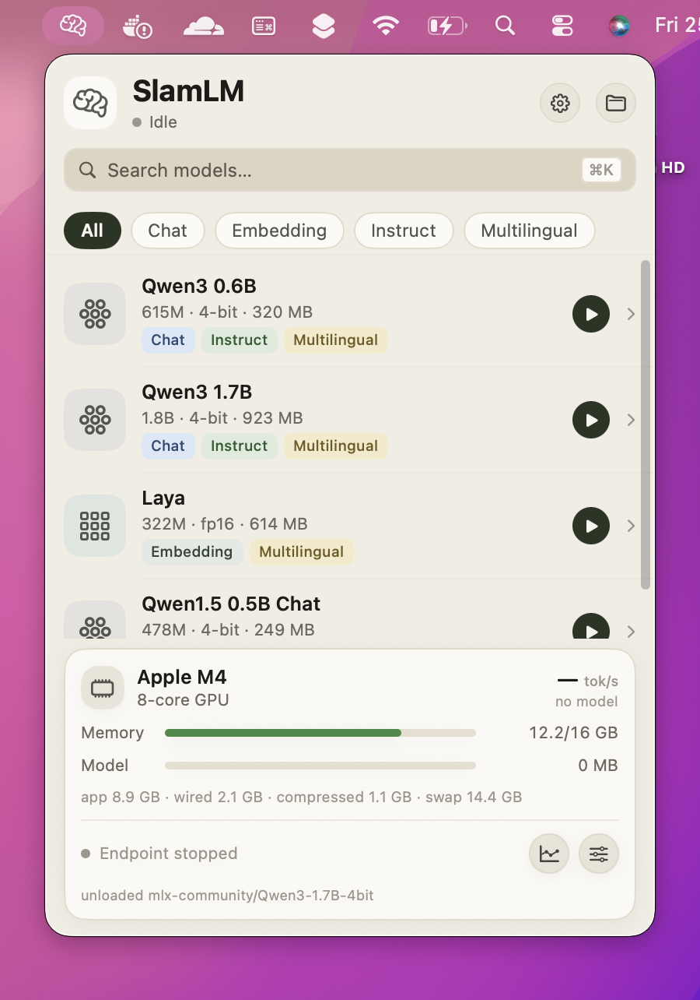
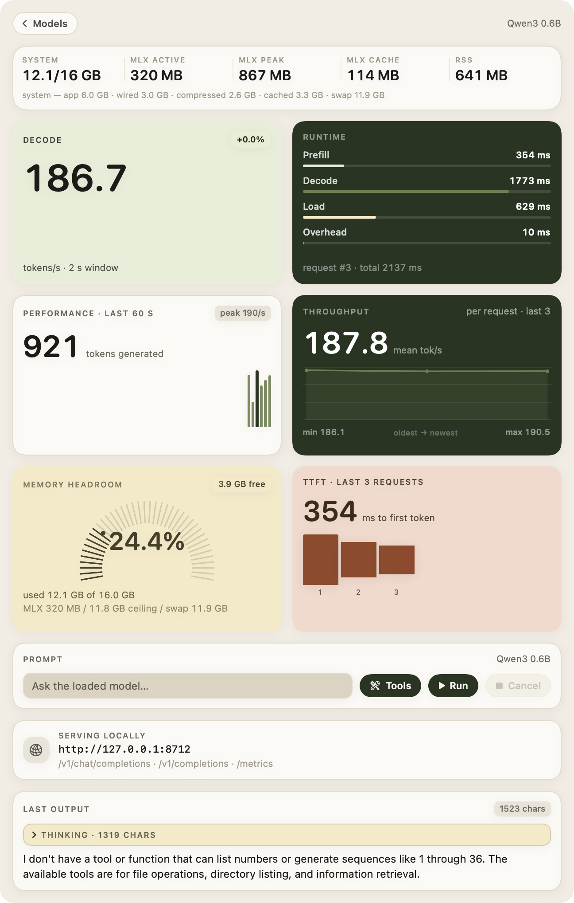
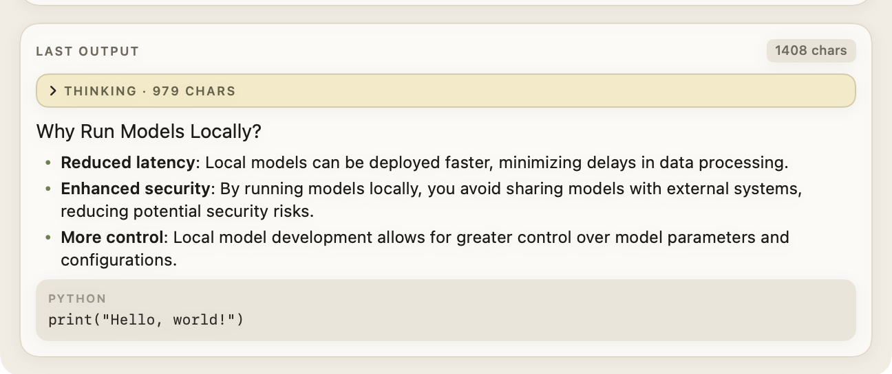
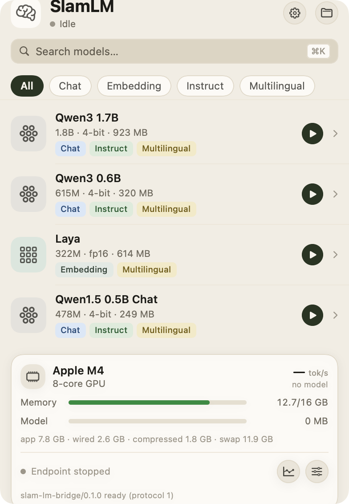
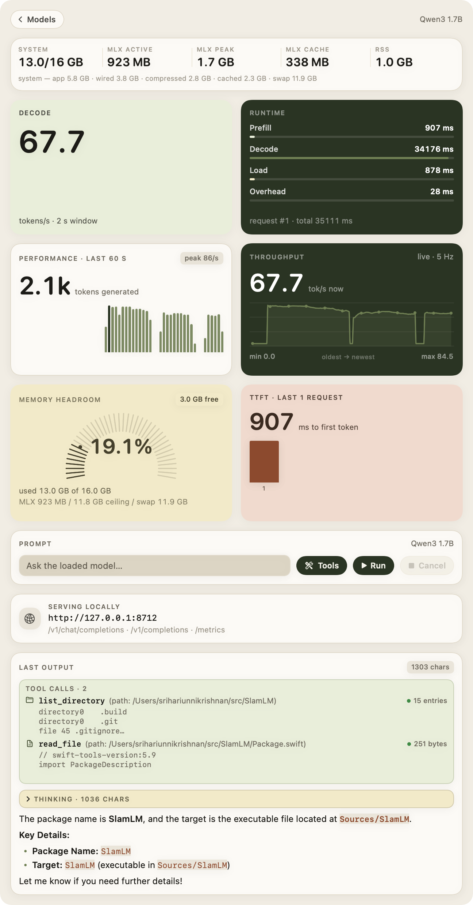
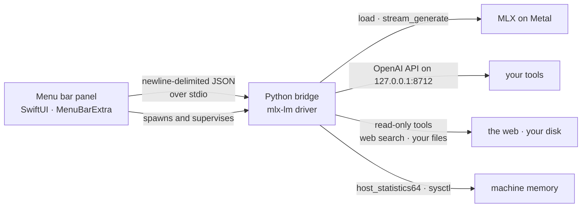

<div align="center">

# SlamLM

**Run local language models from your menu bar.**

Pick a model, press play, and watch what it actually does — decode throughput, time to
first token, where the step time went, and what the machine is really using.




<sub>The menu bar item and the panel it opens — there is nothing else to launch.</sub>

</div>

---

## Why

Running a model locally is a two-line command, but answering *"which model, and is it
fast enough?"* usually means reading logs. SlamLM keeps that in the menu bar: the models
you have, their real sizes, and a live board of measurements taken while you use them.

Every number in the app is measured. Nothing is estimated, interpolated or defaulted — a
metric with no data shows an empty state rather than a plausible-looking placeholder.

## The analytics tab

Click the chart button in the footer and the panel expands into the metrics board.

<div align="center">

</div>

| card | what it shows | source |
|---|---|---|
| **Decode** | tokens/s over the last 2 s, with a delta against the session median | per-token timestamps |
| **Runtime** | where the last request's wall clock went: prefill, decode, load, overhead | measured spans |
| **Performance** | tokens generated, and a tally per second over the last 60 s | 5 Hz telemetry |
| **Throughput** | decode rate of each finished request — is this model faster than the last? | request history |
| **Memory headroom** | free physical memory, plus MLX's own working set and the machine's swap | Mach + sysctl |
| **TTFT** | time to first token per request, with the prefill share of each | per-request spans |

### Chat output, rendered

Model answers are rendered as markdown in the same palette. The model's reasoning is kept
behind a disclosure, so the answer is the thing you read.

<div align="center">

</div>

## Features

- **Model picker** — scans your Hugging Face cache and lists what is really there: real
  parameter counts, quantisation and on-disk size, with category filters and search.
- **One-click run** — loading a model also starts an OpenAI-compatible endpoint on
  `127.0.0.1:8712`, so any client can use the same model the panel is showing.
- **Live metrics** — a 5 Hz telemetry stream from the bridge, charted without smoothing
  that invents values.
- **Real memory** — machine-wide memory in Activity Monitor's terms, not just this
  process's footprint, because on Apple silicon there is one unified pool.
- **Markdown output** — headings, lists, tables, quotes and code, in the app's palette.
- **Tools, read-only** — with the Tools switch on, the model can search the web and
  explore your files before answering, and the panel shows every call it made. There is
  no write, edit, move, delete or shell tool, and file access is confined to the root in
  `SLAM_LM_TOOL_ROOT` (your home directory by default).
- **No token budget to set** — a request runs until the model stops on its own, so
  answers are not truncated by a number you have to remember to raise. A 2048-token
  safeguard per round stops a model that never emits its stop token from generating
  for minutes and pushing the machine into swap; `SLAM_LM_MAX_TOKENS` changes it.
- **Chat templating** — prompts go through the model's own chat template, the same path
  the HTTP endpoint uses.
- **Keyboard and VoiceOver friendly** — every control is labelled; `⌘K` focuses search.

<div align="center">

<sub>A model running: the row reads <i>Running</i>, and the footer carries the endpoint and the machine's memory.</sub>
</div>

## Tools

The switch next to the prompt lets the model reach outside its weights before it
answers. Every call appears in the panel — what was asked, whether it worked, and
what came back — so an answer that cites the web or one of your files shows its
work.

<div align="center">

<sub>Two tool calls above the answer: what was asked, whether it worked, and what came back.</sub>
</div>

| tool | what it does |
|---|---|
| `web_search` | keyless web search (DuckDuckGo); returns titles, URLs and snippets |
| `read_file` | reads a text file, truncated to a byte budget |
| `list_directory` | one directory's entries with kind, size and modification time |
| `search_files` | recursive glob, capped at 200 matches |
| `file_info` | kind, size and modification time for one path |

All five are read-only. There is deliberately **no** write, edit, move, delete or
shell tool, and file access resolves symlinks and refuses anything outside the
tool root — `SLAM_LM_TOOL_ROOT`, your home directory by default:

```sh
SLAM_LM_TOOL_ROOT=~/work bash build.sh   # narrower root, recorded at build time
```

The loop is bounded: at most four rounds of call → execute → continue, and the run
ends as soon as the model answers without calling a tool. A refused path or a failed
request is handed back to the model as an error it can react to, never swallowed.

**What leaves the machine:** a `web_search` query, and nothing else — the model
itself is local. Turn the switch off and there is no network access at all.

Search is keyless: the bridge tries DuckDuckGo's HTML endpoint, its lite endpoint
and Brave, in that order, and names which one answered. If every provider refuses —
search engines rate-limit by IP, and a session of heavy use will hit that — the tool
reports each refusal verbatim and hands that back to the model, rather than returning
nothing and letting it invent an answer.

## Requirements

- An Apple silicon Mac (M-series)
- macOS 14 Sonoma or later
- Python 3.10 or later
- No Xcode required — the Swift Command Line Tools are enough

## Installation

### 1 · Install MLX and `mlx-lm`

SlamLM does no inference of its own; it drives [MLX](https://github.com/ml-explore/mlx)
through [`mlx-lm`](https://github.com/ml-explore/mlx-lm). Install `mlx-lm` with `pip` or
`conda`, exactly as the MLX docs describe:

**With `pip`** (creates the virtualenv the app expects, in the project directory):

```sh
git clone https://github.com/pythongiant/SlamLM
cd SlamLM
python3 -m venv .venv
.venv/bin/pip install -r requirements.txt
```

**With `conda`**:

```sh
conda install -c conda-forge mlx-lm
```

`mlx` itself is installed for you on macOS as a dependency of `mlx-lm`. Check the
installed versions at any time:

```sh
.venv/bin/python -c "import mlx.core, mlx_lm; print(mlx.core.__version__)"
```

SlamLM works with the released package and with a source checkout: the test suite passes
against both `mlx-lm` 0.31.3 from PyPI and current `mlx-lm` from `main`.

### 2 · Build the app

```sh
bash build.sh          # builds, bundles into build/SlamLM.app, ad-hoc signs it
open build/SlamLM.app  # the icon appears in your menu bar
```

`build.sh` records the interpreter and project directory it was built against, so the
packaged app can find them even when launched from Finder. To use an interpreter
somewhere else:

```sh
SLAM_LM_PYTHON=/path/to/python bash build.sh
```

No Xcode project is involved: the app is a SwiftPM package, `build.sh` assembles the
bundle (`LSUIElement`, so no Dock icon) and signs it ad hoc.

### 3 · Get a model

The picker lists whatever is in your Hugging Face cache. To add one:

```sh
.venv/bin/hf download mlx-community/Qwen3-1.7B-4bit
```

Then open the gear menu in the panel and choose **Refresh catalog**.

> Prefer a source checkout of `mlx-lm` over the installed package? SlamLM finds a local
> `mlx_lm/` directory as well, and `SLAM_LM_REPO` points it at a checkout explicitly.

## Usage

| | |
|---|---|
| **Open the panel** | Click the brain icon in the menu bar. `bash build.sh run` opens the same panel in a window. |
| **Run a model** | Press the play button on a row. The row shows *Running*, the header shows the loaded model, and the endpoint starts. |
| **Stop it** | Press the same button again — the model is unloaded and the MLX buffer cache is freed. |
| **Generate** | Open the analytics tab, type into the prompt box and press **Run**. Output streams into *Last output*, and the run continues until the model stops. |
| **Let it use tools** | The **Tools** switch in the prompt row. On: the model may search the web and read files, and each call is listed above the answer. Off: it answers from its weights alone. |
| **Quit** | Gear menu → *Quit SlamLM* (it is a menu bar app, so there is no Dock icon). |

### Use the endpoint from anything

While a model is running, `127.0.0.1:8712` speaks the OpenAI API:

```sh
curl http://127.0.0.1:8712/health
curl http://127.0.0.1:8712/v1/models

curl -X POST http://127.0.0.1:8712/v1/chat/completions \
  -H 'Content-Type: application/json' \
  -d '{"messages":[{"role":"user","content":"Explain MLX in one sentence."}],"max_tokens":64}'
```

Streaming works too (`"stream": true`), as does `/v1/completions`. Point any
OpenAI-compatible client at `http://127.0.0.1:8712/v1`. A request may set `max_tokens`
(absent means no budget) and `tools: true` to let the model call the tools above.
Requests from other clients are measured alongside the panel's own, so the charts fill
in as your tools use the model. `GET /metrics` returns the raw numbers behind the board.

## How it works



The app is thin and the bridge does the work:

- **`Sources/SlamLM/`** — the panel: catalog, analytics board, markdown rendering, and a
  client that speaks the bridge protocol and owns the child process.
- **`sidecar/slam_lm_bridge/`** — the bridge: model catalog, runner, 5 Hz telemetry, the
  OpenAI-compatible HTTP API, and process lifetime. Standard library plus `mlx-lm`.
- **[`PROTOCOL.md`](PROTOCOL.md)** — the wire contract between them: every command,
  event, field and metric definition. It is the file to read first.

## What the numbers mean

| metric | definition |
|---|---|
| **Decode tok/s** | generated tokens divided by the time between the first and last token of a request; the live figure is a 2 s trailing window |
| **TTFT** | wall clock from request submit to the first token, so it includes the prefill pass |
| **Prefill tok/s** | prompt tokens divided by TTFT |
| **Load** | time to load and warm the model, shown separately because it happens outside a request |
| **System memory** | `physical − free − cached`, with app, wired, compressed, cached and swap reported separately — Activity Monitor's definitions, read from Mach page counts and `sysctl` |
| **MLX active / peak / cache** | what MLX itself holds: live tensors, the session high-water mark, and its reusable buffer pool |
| **RSS** | the bridge process's resident set |

Bytes are printed in binary units, so `16 GB` means 16 GiB and a gauge's numbers add up.

## Development

```sh
.venv/bin/pip install pytest
.venv/bin/python -m pytest sidecar/tests/test_bridge.py -q     # 27 tests, ~20 s
```
The suite drives a real bridge: it spawns the process, loads a real model, generates, and
asserts against the OS (`vm_stat`, `sysctl`) rather than against itself.

```sh
bash build.sh debug     # unoptimized build
bash build.sh run       # panel in a normal window
bash build.sh menubar   # panel as a menu bar item
bash build.sh capture   # render both panels to build/captures/
```

Useful flags on the binary itself — `--preview`, `--tab analytics`, `--port 9000`,
`--snapshot <png>`, `--snapshot-analytics <png> --model <id> --tokens <n> --requests <n>
--prompt "<text>" --load`. The snapshot modes render offscreen with real data and exit
non-zero rather than produce a picture with fake numbers; they are how the screenshots in
this README were made. See [`PROTOCOL.md`](PROTOCOL.md) for the full list and environment
overrides.

## Credits

Built on [MLX](https://github.com/ml-explore/mlx) and
[`mlx-lm`](https://github.com/ml-explore/mlx-lm), both MIT-licensed and maintained by
Apple's MLX team, and on the model weights you already have in your Hugging Face cache.
